# VOD Manager — User Guide

A complete walkthrough: install it, connect your real sources, wire it into
Dispatcharr (one instance or several), lock it down, and use the curation
tools day to day. For a quick technical reference instead of a guided
walkthrough, see [README.md](README.md).

> Screenshots in this guide have provider names, IP addresses, hostnames,
> and account identifiers replaced with placeholders (`Provider A`,
> `203.0.113.10`, `provider-a.example.com`, etc.) — your own screen will show
> your real provider names and data in their place.

## Table of contents

1. [What VOD Manager does](#1-what-vod-manager-does)
2. [Prerequisites](#2-prerequisites)
3. [Installation](#3-installation)
4. [First-run setup](#4-first-run-setup)
5. [Adding your first provider](#5-adding-your-first-provider)
6. [Connecting Dispatcharr](#6-connecting-dispatcharr)
7. [Security hardening](#7-security-hardening)
8. [Browsing and managing your catalog](#8-browsing-and-managing-your-catalog)
9. [AI-assisted features](#9-ai-assisted-features)
10. [Curation tools](#10-curation-tools)
11. [TMDB integration](#11-tmdb-integration)
12. [Backup and restore](#12-backup-and-restore)
13. [Troubleshooting](#13-troubleshooting)

---

## 1. What VOD Manager does

VOD Manager pulls movies and TV shows from whatever real sources you have —
one or more Xtream-Codes (XC) IPTV providers, a Plex server, an Emby or
Jellyfin server — and merges them into a single deduplicated catalog (the
*pool*). It then re-exposes that pool as its own XC-compatible server, so
Dispatcharr (or any other XC client) can pull it in exactly like it would
pull in a real provider.

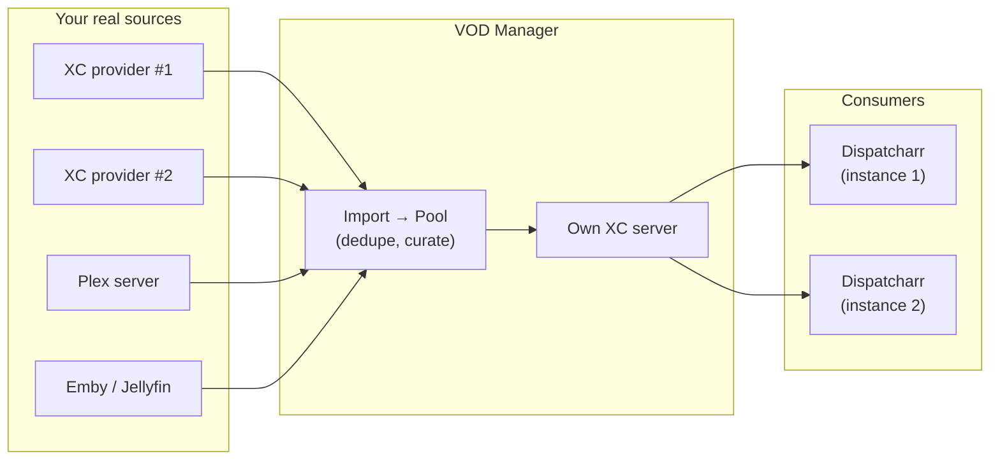

Why this matters in practice:

- **Same movie, multiple sources.** If the same title is available from two
  different IPTV resellers (or from a reseller *and* your own Plex), VOD
  Manager treats those as multiple *sources* of one pool entry, not two
  separate catalog items — and automatically fails over between them if one
  goes down or hits its connection limit.
- **Recommended deployment**: on the same host/stack as Dispatcharr, since
  the two talk to each other constantly. It's fully capable of running on
  its own separate host too — nothing about it requires colocation, it's
  just one network hop closer if it's local.

---

## 2. Prerequisites

- Docker + Docker Compose
- `ffmpeg` — already bundled in the image, nothing to install separately
- At least one real VOD source: an XC-type IPTV provider, a Plex server, or
  an Emby/Jellyfin server
- One or more [Dispatcharr](https://github.com/Dispatcharr/Dispatcharr)
  instances to pull the resulting catalog into
- Optional but recommended: a free
  [TMDB API key](https://www.themoviedb.org/settings/api) (v3 auth) — used
  for enrichment, duplicate/year disambiguation, and the missing-artwork
  queue. The app works without one; those specific features just won't.
- Optional: an API key from Anthropic, OpenAI, and/or Google (Gemini) if you
  want the AI-assisted features (§9)

---

## 3. Installation

Create a `docker-compose.yml`:

```yaml
services:
  vod-manager:
    image: ghcr.io/jstevenscl/vod-manager:latest
    container_name: vod-manager
    restart: unless-stopped
    ports:
      - "8282:8282"
    volumes:
      - vod_manager_data:/app/data

volumes:
  vod_manager_data:
```

Start it:

```bash
docker compose up -d
```

Building from source instead of pulling the published image — e.g. for
local development against this repo — works too:

```bash
docker build -t vod-manager:local .
```

The app listens on port `8282`. All persistent state (config, credentials,
the catalog database) lives in the `vod_manager_data` volume — safe across
image rebuilds and container recreation.

**Optional environment variables** (for initial/recovery admin login —
normally you'll just set a login through the UI on first run instead):

| Variable | Purpose |
|---|---|
| `VODMANAGER_ADMIN_USER` / `VODMANAGER_ADMIN_PASSWORD` | Overrides the stored login entirely while set — useful to regain access if you're ever locked out, or to provision a login via your deployment tooling instead of the UI. |
| `DATA_DIR` | Where persistent state is stored (default `/app/data`, matches the volume mount above — only change this if you're customizing the container layout). |

---

## 4. First-run setup

On first visit, VOD Manager asks you to set an admin username and password.

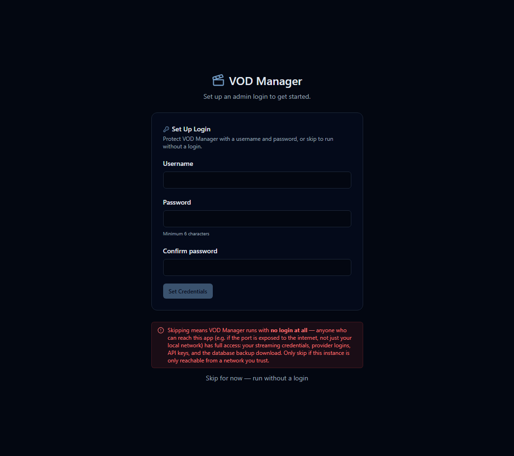

**Set a real login here.** There's also a "Skip for now — run without a
login" option for purely LAN/VPN-only deployments that don't need it, but
skipping means **every single feature is reachable with zero
authentication** by anyone who can reach the port — your provider
credentials, AI/TMDB API keys, and a full database backup download included.
The app will show you an explicit warning and ask you to confirm before
letting you skip, precisely because this is easy to click past without
thinking about it. If there's any chance this port is ever reachable from
outside a network you fully trust, set a login now — you can always change
it later from the gear icon → *Account settings*.

Password requirements: 6+ characters minimum. Passwords are hashed with
PBKDF2-HMAC-SHA256 (260,000 iterations) before being stored — never in
plain text, and not with a fast general-purpose hash either.

---

## 5. Adding your first provider

Go to the **Curation & Maintenance** tab → *Providers*. Pick a type
(Xtream-Codes, Plex, Emby, or Jellyfin), fill in its connection details, and
click **Add**.

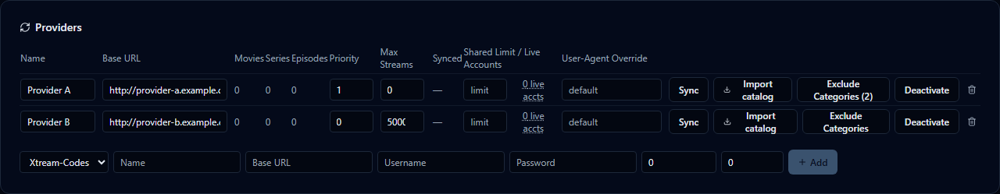

Each provider row also has:

- **Priority** — lower numbers are preferred when the same title is
  available from more than one source; VOD Manager tries them in order and
  fails over automatically.
- **Max streams** — a hard cap on concurrent connections VOD Manager itself
  will open against this provider (`0` = unlimited).
- **Shared Limit / Live Accounts** — if this same real subscription also
  feeds a *live TV* account somewhere in Dispatcharr, link them here so VOD
  usage and live-TV usage draw from one accurately-tracked pool instead of
  silently exceeding your real connection limit. See your provider's actual
  plan for its real concurrent-stream cap.
- **User-Agent override** — some providers (a real example: one popular XC
  reseller) silently drop any request that doesn't look like it's coming
  from a browser. Leave this blank unless a specific provider needs it;
  VOD Manager already sends a normal desktop-browser User-Agent by default.

Once a provider is added, click **Import catalog** to pull its listing in
for the first time. This is a metadata-only pass (name/year/category/stream
ID) — poster art, cast, and descriptions are fetched lazily per-item after
that (see *Rich Metadata* at the top of the same tab for a manual bulk-fetch
button, or just let the background refresh schedule handle it — §6 in
[README.md](README.md#refresh-schedule)).

### Excluding content on import

If a provider's catalog includes languages or categories you don't want in
your library at all — especially relevant for a provider with a very large
catalog, where manually cleaning up after the fact isn't practical — VOD
Manager can auto-archive matching titles the moment they're imported (or
re-imported), instead of only being able to filter them out after the fact.
Archived, never deleted: still fully browsable/playable/categorizable if you
ever change your mind, just out of the way by default.

**Language** (Curation & Maintenance → *Import Language Exclusion*) is
global — the same rule applies to every provider, since the languages you
don't want almost never depend on which provider a title came from. Two
independent ways to match: a comma-separated list of language-prefix codes
(the same `AR|`, `FR|`, `EN|`-style tags used by Language Filter, §10), and/or
a toggle to exclude any title with non-Latin-script characters in its name.

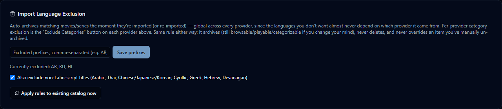

**Category** (the **Exclude Categories** button on each provider row) is
per-provider, since available categories genuinely differ from one provider
to the next — the picker shows exactly what that provider itself calls its
categories, fetched live, not a guessed or fixed list.

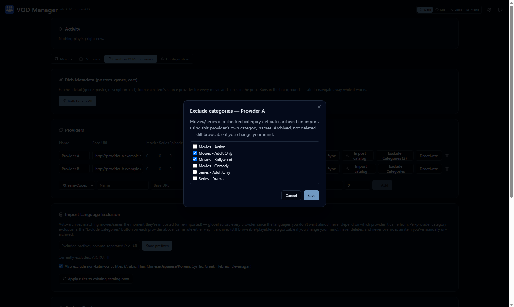

Turning either of these on only affects **future** imports by default. If
you already have a large catalog and want the new rules applied
retroactively, click **Apply rules to existing catalog now** — this
re-imports every active provider to pick up the current rules across
everything already in your pool, which for a very large catalog can take a
while (the same cost as a normal full catalog import).

---

## 6. Connecting Dispatcharr

VOD Manager distinguishes two separate relationships with Dispatcharr, both
configured under **Configuration**:

- **Connected Instances** — *who's allowed to pull from VOD Manager.*
- **Dispatcharr Connections** — *who VOD Manager itself reaches out to*, to
  push connection-limit data and check live-TV viewer counts for the
  shared-limit coordination mentioned above.

A single Dispatcharr instance is usually both at once. They don't have to
match — you can have an instance that only pulls, and a connection VOD
Manager only reaches out to for coordination.

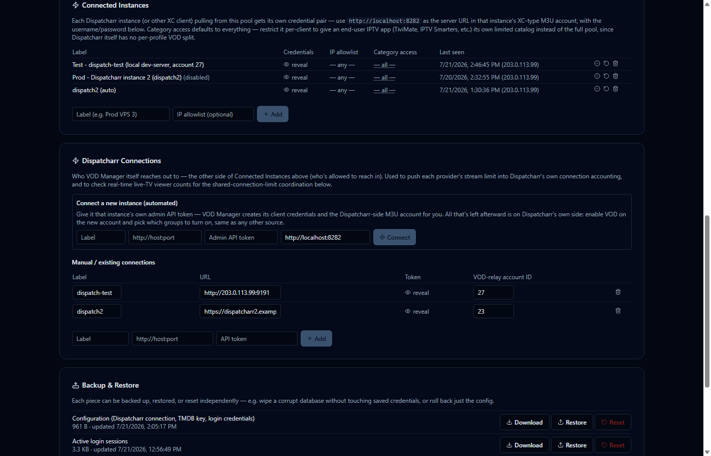

**A fresh install starts with two categories already in place**: "All
Movies" and "All TV Shows", smart categories that automatically include
everything in your pool and stay current as new content is imported — no
manual step needed. This exists because Dispatcharr's VOD refresh aborts
entirely (rather than syncing an empty catalog) if it gets back zero
categories, so a brand-new instance always has something to sync against
from the start. The first time you see the app, you'll be asked once
whether 18+ content should be included in those two categories — it's
excluded by default until you answer. You can still build your own
categories (Manage Categories) on top of, or instead of, these two.

### Before you start: remove existing provider VOD from Dispatcharr

If any of your providers are already connected directly in Dispatcharr with
VOD enabled, turn that off first. Otherwise you end up with the same movies
and series pulled in twice — once straight from the provider, once again
through VOD Manager's own pool — competing for the same groups.

Do this **one provider at a time**, not all at once — running it across
every provider simultaneously can cause database issues.

For each provider:

1. Open that provider's settings in Dispatcharr and go to **Groups → VOD -
   Movies**, click **Deselect Visible**, then switch to the **VOD - Series**
   tab and click **Deselect Visible** there too. Click **Save**, then
   refresh the provider and wait for it to finish refreshing its VOD before
   continuing.
2. Go back into that provider's settings and turn off **Enable VOD
   Scanning**.
3. Move on to the next provider and repeat steps 1–2. Don't start the next
   one until the current provider's refresh has fully finished.

Once every provider is done, open the **VODs** modal in Dispatcharr and
confirm both Movies and Series are empty. Only then are you ready to attach
VOD Manager as the new source.

### Connecting a single instance (the easy way)

Under *Dispatcharr Connections → Connect a new instance*, give it:

- A label of your choosing
- That Dispatcharr instance's own URL and an **admin API token** from it
- VOD Manager's own URL, **as reachable from that Dispatcharr instance** —
  this is not always the same URL you're viewing VOD Manager at yourself. A
  co-located instance (same Docker network/host) might use an internal
  hostname; a remote one needs your real public/VPN-reachable URL.

Click **Connect**. VOD Manager automatically:

1. Creates its own high-entropy client credentials
2. Creates the Dispatcharr-side XC M3U account for you, capped at 50
   concurrent streams at the account level (generous on purpose — your real
   per-provider limits are enforced separately, per source, not here)

The only thing left is on Dispatcharr's own side: open the new M3U account,
enable VOD, and pick which groups/categories to turn on — the same setup
any other source needs.

### Connecting multiple instances

Repeat the same "Connect a new instance" flow for each additional
Dispatcharr instance — a household/production instance and a
testing/staging one, for example, or fully separate deployments for
different audiences. Each gets its own independent credential pair under
*Connected Instances*, so revoking or regenerating one never touches the
others.

**Per-instance category access control**: Dispatcharr has no per-user VOD
split of its own — everyone on a given Dispatcharr instance sees whatever
that instance's M3U account can see. To give one instance (or one end-user
IPTV app pointed straight at VOD Manager, bypassing Dispatcharr entirely) a
*restricted* catalog — a kids-only view, for example — set that instance's
*Category access* under *Connected Instances* to a specific set of
categories instead of leaving it at "— all —". This is enforced everywhere
that credential is used (catalog listing, detail lookups, and the actual
stream), not just hidden from a browse UI — a restricted client can't reach
disallowed content even with a raw copied stream URL.

---

## 7. Security hardening

If this is reachable beyond a network you fully trust — and especially if
it's reachable from the public internet at all — do these:

1. **Set a real login** (§4) and don't use the Skip option.
2. **Put TLS in front of it.** VOD Manager doesn't terminate TLS itself —
   use a reverse proxy (nginx, Caddy, Traefik) or a tunnel (Cloudflare
   Tunnel, Tailscale, WireGuard) if it's reachable from outside your LAN.
   This matters more than usual here: the XC protocol itself has no session
   concept beyond a username/password checked on every request, so an
   unencrypted connection exposes real streaming credentials on the wire.
3. **Leave the login lockout on** (Configuration → Security) — repeated
   failed admin-login or XC-client-login attempts from one address get
   temporarily locked out. Defaults are reasonable; tighten them for an
   internet-facing deployment.

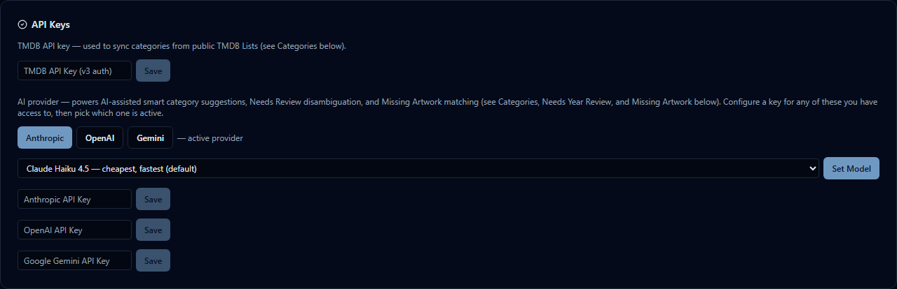

4. **Give every connected instance its own credential** (already the
   default — §6) rather than sharing one across multiple Dispatcharr
   instances, so a compromised credential is cheap to revoke without
   affecting anything else.
5. **Optional per-instance IP allowlist**, if a connected instance's source
   IP is known and stable. Leave it blank for anything behind CGNAT or a
   rotating IP — locking those would just break them, not add real
   security, since the address isn't a reliable identity signal for them.
6. Lockout state is in-memory and resets on container restart — this
   slows down a sustained automated attacker; it isn't a substitute for
   putting this behind a VPN/tunnel once it's reachable beyond your own
   network.
7. **Provider passwords, Dispatcharr tokens, and XC client secrets are
   encrypted at rest** in the database (not just hashed logins) — the
   encryption key lives in `config.json` so it travels with that file's own
   backup/restore lifecycle (§12). Existing plaintext values from before
   this was added upgrade automatically on next startup, no action needed.

---

## 8. Browsing and managing your catalog

The **Movies** and **TV Shows** tabs are the main catalog views, each with a
**list** or **grid** (poster wall) mode.

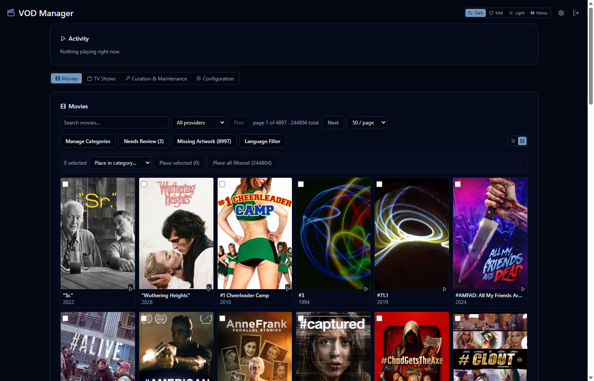

- **Search / provider filter / page size** — top toolbar.
- **Manage Categories**, **Needs Review**, **Missing Artwork**, **Language
  Filter** — open the curation tool modals covered in §10, scoped to
  whichever tab (movies vs. series) you opened them from.
- **Bulk category placement** — select items (checkbox) or use "Place all
  filtered" to place everything matching the current search/filter into a
  category in one action, without paging through results manually.
- **Rename / fix year** — every item's detail view (click a row, or a tile
  in grid mode) has this. Providers occasionally send a blank, garbled, or
  otherwise wrong title/year with no other way to correct it — this fixes
  that directly. If the corrected name+year now matches an existing pool
  entry exactly, the two are merged automatically instead of leaving a
  duplicate.

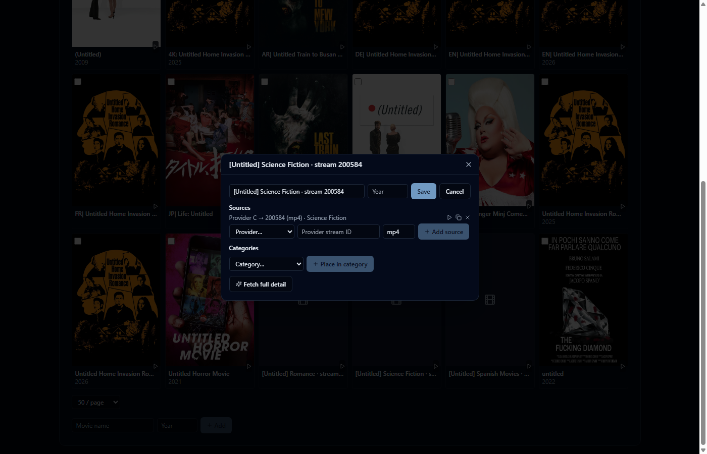

---

## 9. AI-assisted features

An API key from **any** of Anthropic, OpenAI, or Google (Gemini) unlocks
the AI-assisted features — configure one or more under **Configuration →
API Keys**, then pick which one is active. Switching providers later is
just a click; nothing else about the features changes.


None of these ever apply anything automatically — every one is a suggestion
you still review and confirm yourself:

- **Suggest a category with AI** (Categories modal) — describe a category
  in plain English; the AI proposes a structured filter rule using the same
  fields the manual rule builder uses (name, genre, year, country/language,
  director, is_adult).
- **AI Evaluate** (✨ on any category) — for criteria the rule fields can't
  express (mood, plot, audience fit), the AI judges actual titles against
  your description instead of matching fields. Runs over a bounded
  candidate set, never silently against the whole pool — the result always
  reports how many were actually considered.
- **Ask AI** (Needs Review, Missing Artwork) — when an item is ambiguous
  (no year, or no confident poster match), the AI picks the most likely
  correct match among the real TMDB search candidates already shown, with
  its reasoning and a confidence level. You still click a candidate
  yourself to apply it.

Each provider has a model dropdown (Configuration → API Keys) with a
curated set of options, from cheapest/fastest to most capable — defaults to
the cheapest tier, since most of these features make many small requests
rather than needing flagship-level reasoning per call. Switching provider
resets the model choice to that provider's own default rather than carrying
over a model id that belongs to a different provider.

---

## 10. Curation tools

All of these live under the **Movies**/**TV Shows** toolbars or the
**Curation & Maintenance** tab, and follow the same philosophy throughout:
*scan or filter first, review what's found, then apply* — nothing runs
automatically against your whole library without you seeing what it found
first.

### Missing Artwork

Movies/series with no poster — usually because the source provider's own
catalog data just didn't include one. Search or filter (by language, see
below), then either pick a real TMDB match per item (with an AI-suggest
option) or blanket-apply one image to everything matching your filter at
once — useful for content that will never have a real per-title poster
(e.g. a batch of clips from the same creator/source).

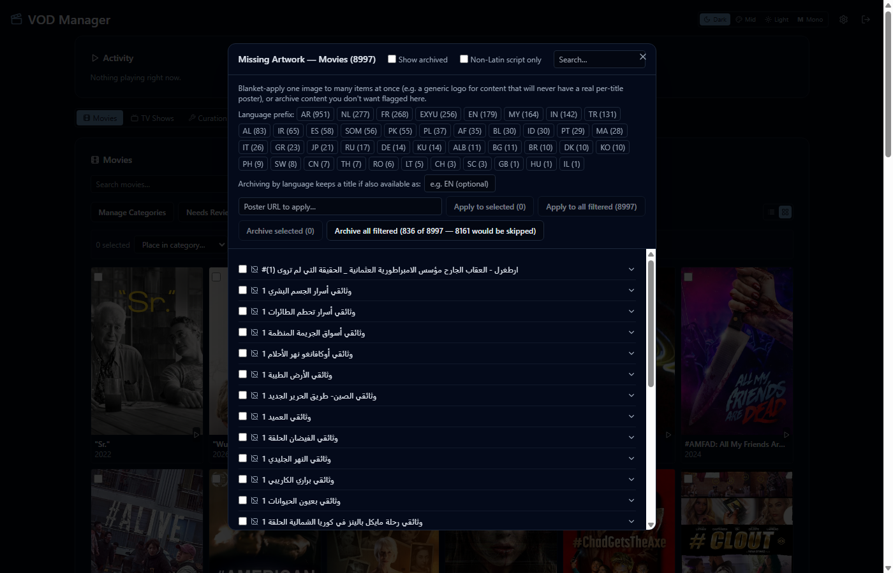

Also supports **archiving**: hide matching items from this queue (and
Needs Review, and Duplicate Finder) without deleting anything — still fully
browsable, playable, and usable in categories, just no longer flagged as
needing attention. Useful for content you've decided not to curate further
(e.g. a language you don't plan to add posters for).

### Language Filter

The same language-based filtering as Missing Artwork, but over your *whole*
library — a title with a real poster is just as much "not in your language"
as one without.

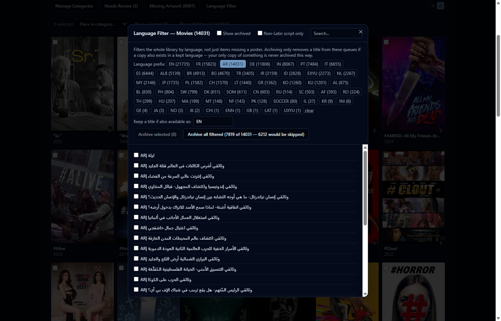

Two independent ways to isolate content by language:

- **Non-Latin script detection** — flags titles containing Arabic, Thai,
  Chinese/Japanese/Korean, Cyrillic, Greek, Hebrew, or Devanagari
  characters. Broad and automatic, no setup needed.
- **Language-prefix picker** — many providers tag dubbed/subtitled variants
  with a leading code like `AR|`, `FR|`, `EN|`. The picker shows exactly
  which codes are actually present in *your* catalog, with real counts —
  not a fixed guessed-in-advance list, so it adapts to whatever your
  providers actually use, including non-language category tags some
  providers reuse the same convention for (you'll see those too — just
  don't select ones that obviously aren't languages).

**Archiving here is sibling-aware by design**: type a code (or several) into
*"Keep a title if also available as"*, and a title only gets archived if a
copy also exists in a kept language (or with no language tag at all) —
never your only copy of something, just because it happens to not be in a
language you picked. The archive button shows a live preview
(`Archive all filtered (25 of 36 — 11 would be skipped)`) that updates as
you adjust the filter, so you can see exactly what will happen before you
commit to it.

### Duplicate Finder

Finds same-year pool entries whose names differ only by cosmetic
punctuation — a colon, a dash, quote style — which happens because real
providers format the same title slightly differently from each other. Pick
which spelling to keep per group; the rest merge into it (sources,
categories, and episodes all move over automatically, nothing is lost).

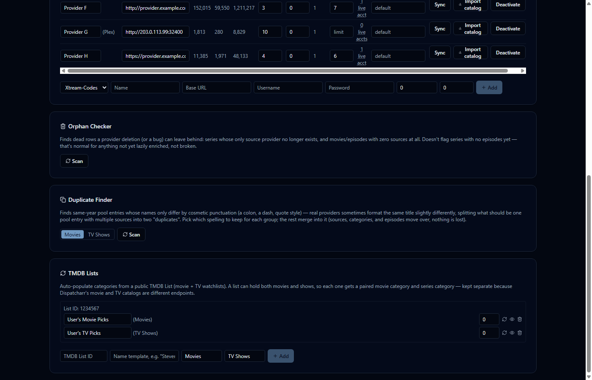

### Needs Review

Items imported with no year, where more than one existing pool entry shares
the same name — too ambiguous to auto-merge, so they're held out of every
category until you (or the AI, as a suggestion) pick the right one, usually
from a real TMDB match rather than having to research it yourself.

### Orphan Checker

Finds dead rows a provider deletion (or a bug) can leave behind — a series
whose only source provider no longer exists, or movies/episodes with zero
sources at all. Run it periodically, especially after removing a provider.
It won't flag a series with no episodes yet — that's normal for anything
not yet lazily enriched, not broken.

---

## 11. TMDB integration

A free [TMDB API key](https://www.themoviedb.org/settings/api) (v3 auth)
under Configuration → API Keys unlocks:

- Real TMDB search for the Needs Review and Missing Artwork flows above
- **TMDB Lists** (Curation & Maintenance) — link a public TMDB List (a
  personal watchlist, for example) to auto-populate a category. A list can
  contain both movies and shows, so linking one creates a paired movie
  category and series category — kept separate since Dispatcharr's movie
  and TV catalogs are different endpoints. Only items already present in
  your pool ever get placed; this organizes existing content, it doesn't
  pull in anything new.

---

## 12. Backup and restore

Configuration → Backup & Restore lets you download, restore, or reset each
piece of state independently — configuration, login sessions, and the
catalog database. Useful for resetting a corrupted database without losing
saved credentials, or rolling back just the config. Database downloads use
SQLite's `VACUUM INTO` for a consistent snapshot even while the app is
actively writing to it.

**Diagnostics.** Configuration → Diagnostics has a "Download Diagnostic
Logs" button — it exports the app's own log history with provider
credentials, hostnames, and IP addresses scrubbed, safe to attach to a bug
report or support request without exposing anything sensitive about your
setup. The version shown in the top header (hover it for the branch/tag it
was built from) is worth including too, especially when running a `:dev`
build rather than a tagged release.

---

## 13. Troubleshooting

**A provider's catalog won't import / times out.** Check the User-Agent
override (§5) — some providers reject requests that don't look
browser-like. Also confirm the base URL and credentials work with a
regular XC client first, to rule out a provider-side issue.

**Locked out of your own login.** Set `VODMANAGER_ADMIN_USER` and
`VODMANAGER_ADMIN_PASSWORD` as environment variables on the container and
restart — this overrides the stored login while set, letting you sign in
and set a new one from the UI. Remove the environment variables afterward.

**Dispatcharr says "Provider returned no VOD categories... aborting VOD
refresh."** This means VOD Manager currently has zero categories — normally
impossible since a fresh install auto-seeds "All Movies"/"All TV Shows"
(§6), but it can happen if every category was manually deleted. Create at
least one category (Manage Categories) and re-run the Dispatcharr sync.

**A Dispatcharr instance can't reach VOD Manager.** Double check the URL
you gave it during "Connect a new instance" is reachable *from that
instance's own network position*, not just from your browser — a
Docker-internal hostname won't resolve from a remote instance, and vice
versa.

**Movies/series show up as duplicates.** Run Duplicate Finder (§10) — most
duplication is either a punctuation difference between providers (that
tool) or a language variant (Language Filter, §10). If neither explains
it, check Needs Review for an unresolved year ambiguity.

**A title has no poster.** Check Missing Artwork (§10) — it's usually
either genuinely unavailable from the source provider, or fixable with a
real TMDB search from there.

**Something's wrong with the database.** Configuration → Backup & Restore
lets you download a snapshot before troubleshooting further, and reset just
the database (keeping your saved login/config) if you need a clean slate.
